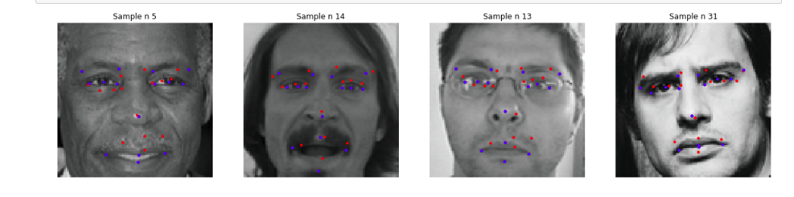
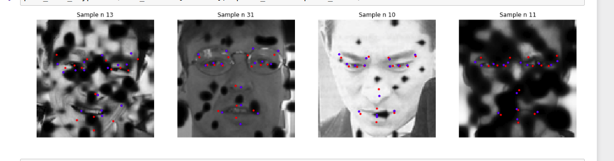

# MobileNet_facekeypoint
记录了MobileNet的facekeypoint处理

> * 人脸定位
> * 数据加载处理
> * MobileNet网络编写
> * 训练与测试

数据集在这里，kaggle的人脸关键节点的定位,该题只有15个关键节点，output是15*2=30：

[数据集](https://www.kaggle.com/c/facial-keypoints-detection)


没用数据增强：



使用数据增强：



红色的点是预测的值，蓝色的点是实际的值


###MobileNet网络 

```python

class MobileNet(nn.Module):
    def __init__(self):
        super(MobileNet, self).__init__()

        def conv_bn(inp, oup, stride):
            return nn.Sequential(
                nn.Conv2d(inp, oup, 3, stride, 1, bias=False),
                nn.BatchNorm2d(oup),
                nn.ReLU(inplace=True)
            )

        def conv_dw(inp, oup, stride):
            return nn.Sequential(
                nn.Conv2d(inp, inp, 3, stride, 1, groups=inp, bias=False),
                nn.BatchNorm2d(inp),
                nn.ReLU(inplace=True),
    
                nn.Conv2d(inp, oup, 1, 1, 0, bias=False),
                nn.BatchNorm2d(oup),
                nn.ReLU(inplace=True),
            )

        self.model = nn.Sequential(
            conv_bn(  3,  32, 2), 
            conv_dw( 32,  64, 1),
            conv_dw( 64, 128, 2),
            conv_dw(128, 128, 1),
            conv_dw(128, 256, 2),
            conv_dw(256, 256, 1),
#             conv_dw(256, 512, 2),
#             conv_dw(512, 512, 1),
#             conv_dw(512, 512, 1),
#             conv_dw(512, 512, 1),
#             conv_dw(512, 512, 1),
#             conv_dw(512, 512, 1),
#             conv_dw(512, 1024, 2),
#             conv_dw(1024, 1024, 1),
            nn.AvgPool2d(7),
        )
        self.fc = nn.Linear(256, nb_out)

    def forward(self, x):
        x = self.model(x)
        x = x.view(-1, 256)
        x = self.fc(x)
        return x

```

这里说明一下，这个不是标准的MobileNet 由于图片输入96*96 标准的MobileNet会把图片卷完，最后消失了。我这里把层数减少了。


### 数据增强

数据增强使用了[imgaug](https://github.com/aleju/imgaug),很优秀的数据增强的库


